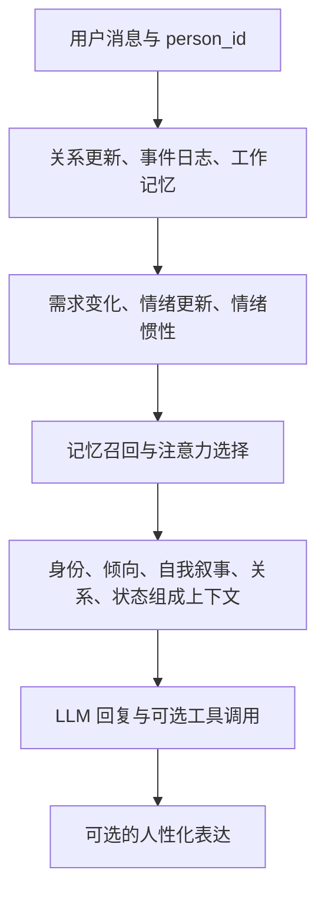

[简体中文](README.md) | [English](README_EN.md)

# 超脑 SuperBrain

**让 AI 的记忆、情绪、人格和关系，能够随交互持续变化。**

SuperBrain 是一个受人类认知与情感机制启发的 Python 内核。它把需求驱动、连续情绪、情绪惯性、人格、关系、注意力和长期记忆组合起来，供聊天机器人、虚拟角色和其他 Agent 接入。它关注的不只是“记住一句话”，还包括：这段经历带来什么状态变化、与谁有关、以后如何被想起，以及如何影响表达和行动。

`v1.21.2` · Python 3.10+ · 核心零第三方依赖 · 可选 MCP · MIT


这里的“仿人类”指可查看、可修改的计算模型：用数值、规则、记忆结构和模型调用表达部分认知机制。它不是生物大脑仿真，也不以此宣称真实意识或主观情感。具体机制已经存在于代码中，行为质量仍取决于模型、参数、数据和接入方式。

## 从一个日常例子理解

假设你在做一个长期陪伴的 Telegram 角色：

- **刚认识时**：系统保存对方标识和关系状态，表达可使用的范围较少。
- **持续聊天后**：熟悉度、信任度和依恋数值发生变化，关系定位按规则重新评估；昵称、共同经历和边界可以保存在关系模型里。
- **对话带来状态变化时**：需求满足程度影响情绪，情绪动量保留一段时间；表达和记忆联想可受这些状态影响。
- **一段时间没有互动时**：调用主动想法引擎，可能产生与久未互动有关的内容；由你的 Bot 决定是否发送。
- **积累很多经历后**：检索、遗忘、复习和巩固模块帮助整理记忆；无需每次把全部聊天历史送给模型。

这是机制的使用场景，不是对任何一次具体回复的承诺。例如当前聊天路径会按固定增量更新关系值，并不代表系统已经准确理解真实人际关系。

## 1. 需求驱动：行为背后的内部状态

[needs.py](src/superbrain/core/cognition/needs.py) 实现五类需求，每类包含当前值、目标值、衰减率和权重。差距形成驱动力，状态更新还包含随机扰动。

| 需求 | 通俗解释 | 在系统中的用途 |
| --- | --- | --- |
| 确定性 Certainty | 希望减少不确定信息 | 参与主导需求判断、注意力和好奇类想法 |
| 胜任感 Competence | 希望有能力完成事情 | 表达能力成长相关的驱动 |
| 自主性 Autonomy | 希望能够作出选择 | 作为内部需求参与状态与目标系统 |
| 归属感 Relatedness | 希望维持连接 | 参与社交、分享相关的主动想法 |
| 能量 Energy | 当前资源与活跃程度 | 作为资源类需求参与内部状态 |

需求驱动力的核心计算是 `max(0, 目标值 − 当前值) × 权重`。这些是可调的工程状态，不是现实中的生理需求。

## 2. 情绪系统：连续变化，而非只有开心或难过

[emotion.py](src/superbrain/core/cognition/emotion.py) 根据需求满足变化等信号更新情绪，并用平滑处理保持状态连续。

| 情绪维度 | 表达的含义 |
| --- | --- |
| Valence / 愉悦度 | 偏正向还是负向 |
| Arousal / 唤醒度 | 平缓还是激动 |
| Dominance / 掌控感 | 对当前局面的控制程度 |
| Confidence / 自信 | 当前状态中的自信水平 |
| Certainty / 确定感 | 内部确定程度 |
| Safety / 安全感 | 内部安全程度 |
| Fatigue / 疲惫度 | 疲劳状态 |
| Attachment / 依恋 | 连接与依恋状态 |

代码还将内部情绪与对外 `Expression` 分开：表达有文本、强度、偏差和原因字段，能够表示“内部状态与说出来的话不完全相同”。这是一种表示能力，不意味着系统可以可靠读懂人类隐瞒的情绪。

### 情绪惯性：上一轮的状态不会立刻消失

[neurochem.py](src/superbrain/core/cognition/neurochem.py) 用三个借用神经化学名称的数值通道模拟不同时间尺度的状态残留：

- **Dopamine / 多巴胺通道**：表示奖赏、期待相关的短期变化。
- **Serotonin / 血清素通道**：表示满足、平稳相关的较慢变化。
- **Cortisol / 皮质醇通道**：表示压力相关的变化和残留。

各通道拥有独立的释放与指数衰减参数，再合成为情绪底色。名称来自生物学启发，参数不应解释为真实人体测量或医学模型。

## 3. 人格与自我：保留跨对话的角色连续性

[personality/](src/superbrain/core/personality/) 将人格拆成独立模块：

| 模块 | 作用 |
| --- | --- |
| Identity | 保存角色身份信息 |
| Seed | 根据情境选取行为倾向 |
| Values | 表示价值观与偏好 |
| SelfModel | 组织自我表征与过去、现在、未来的叙事 |
| Relationship | 保存与不同人的长期关系状态 |

在聊天路径中，行为倾向、自我叙事、关系信息和内部状态会被组装进模型上下文。这样角色表达有持续状态可参考，而不是完全依靠每轮重复一段人设。

## 4. 关系演化：区分“我在和谁说话”

[relationship.py](src/superbrain/core/personality/relationship.py) 为每个 `person_id` 保存信任、熟悉度、依恋、昵称、共同经历、边界、未解决冲突、期望和带来源与置信度的备注。

关系定位包括 `stranger → acquaintance → friend → close → lover`，由数值阈值重新评估。其中亲密与恋人是角色关系标签，不代表真实感情或现实承诺。当前 `chat(..., person_id=...)` 会增加关系数值，规则可以在源码中检查和调整；它尚不是经验证的人际关系推断算法。

`orientations()` 用于查看关系定位，`expression_elements()` 用于查看该定位允许选用的表达类别。

## 5. 主动想法与人性化表达

### 主动想法

[autonomous.py](src/superbrain/core/autonomous.py) 根据需求、关系和记录产生想法，例如久未互动、关心、好奇和分享，并提供去重、冷却与队列机制。

`generate_thoughts()` **返回本次产生的想法，不自动入队**。应用可以直接消费返回值；如采用队列，需要显式 enqueue 后再调用 `drain_thoughts()`。后台 autopilot 也有调度入口。是否发送 Telegram 消息，由上层应用负责。

### 人性化与表达元素

[humanize.py](src/superbrain/core/humanize.py) 根据情绪、熟悉度和昵称进行规则化口语包装；[expression_library.py](src/superbrain/core/expression_library.py) 提供称呼、关心、欢快、低落、亲昵、撒娇等可组合元素。

这两部分有具体模板与规则，不应包装成无限生成或已验证的共情能力。`search_meme()` 还提供表情图片搜索入口，在线源失败时有备用索引；这一路会涉及外部网络。

## 6. 记忆系统：保存经历，也整理经历

### 多种记忆用途与存放层级

代码包含工作记忆、情景记忆、反思相关模块，以及事实和程序性内容的节点表示。节点支持两组不同的分类：

| 分类 | 取值 | 用途 |
| --- | --- | --- |
| 作用域 scope | `user / session / agent` | 区分用户、会话与 Agent 内容 |
| 存放层 tier | `core / recall / archival` | 区分核心、召回和归档内容 |

节点还有置信度、情绪标签、有效时间、访问次数、复习次数和保留强度。作用域字段不是现成的多租户权限系统。

### 四路检索与联想

[retrieval.py](src/superbrain/core/memory/retrieval.py) 将向量相似度、FTS5 关键词、记忆图邻居和概念图关联四路结果通过 RRF 排名融合，返回内容、分数和命中路径。默认哈希嵌入便于零依赖运行，但不等同于训练过的语义嵌入模型。

### 遗忘与复习

[heat.py](src/superbrain/core/memory/heat.py) 使用 `R = exp(−t / S)` 表示保留率：`t` 是距离上次访问的时间，`S` 是记忆强度。热度还结合频次与置信度。复习可以增强强度，未访问的内容随时间降温；并非给所有记忆固定不变的优先级。

### 巩固、重组与压缩

- **Dream**：回顾近期记忆，提炼经验；可使用规则或外部提炼函数。
- **Distill / consolidation**：提供提炼与巩固组件。
- **Deduplicate / reconsolidation**：提供近似记忆整理与再巩固组件。
- **PISA 图式**：用同化、顺应和创建表示经验结构的变化。
- **Hierarchical condensation**：可选的增量摘要树；不是默认替换所有检索路径。
- **时间与事件**：时间体感、时序有效性和事件日志保留发生顺序与来源线索。
- **内容冻结**：通过新节点或关系表达关联与取代，保留原始内容。

这些组件的实际启用路径和配置需要按应用选择；模块存在不等于每条消息都会触发所有机制。

## 7. 注意力、元认知与行动

[attention.py](src/superbrain/core/attention.py) 根据情绪、主导需求、记忆命中和输入选择关注方向。GWT 全局工作空间模块提供另一类认知组织组件。

[metacognition.py](src/superbrain/core/cognition/metacognition.py) 记录决策、推理质量、信心、结果和反思，调整谨慎度与策略偏好；`self_tune.py` 提供自调参机制。这些改变的是内部状态和策略参数，不是自动训练大模型或无限改写自身代码。

目标、LLM 规划、工具注册与 function calling 负责行动相关能力。聊天路径还包含滚动摘要、历史预算和上下文清洗。

## 一轮聊天如何连接这些能力



主动想法、睡眠整理和部分巩固功能由独立调用或调度触发，不是上图每轮必经步骤。

## 安装与离线体验

克隆本仓库，在项目目录安装源码：

```bash
git clone https://github.com/kejixiaoqi666/superbrain.git
cd superbrain
python -m pip install .
# 可选：MCP 接口依赖
python -m pip install ".[mcp]"
# 无需 API Key 的离线记忆示例
python examples/memory_only.py
```

离线示例使用替代模型验证记忆接口，不生成真实模型回复。真实模型接入后：

```python
from superbrain import SuperBrain

brain = SuperBrain.from_env()  # 先按集成指南配置模型环境变量
try:
    brain.remember("对方喜欢茶", scope="user", tier="recall")
    reply = brain.chat("你好，今天想聊聊什么？", person_id="demo-user")
    print(reply)
    print(brain.state())              # 查看需求、情绪等状态
    print(brain.orientations())       # 查看关系定位
    for thought in brain.generate_thoughts():
        print(thought.content)       # 应用自行决定是否展示或发送
    brain.save()
finally:
    brain.close()
```

## 接入方式

| 入口 | 适合谁 | 说明 |
| --- | --- | --- |
| Python 门面 | Python 应用 | 通过 `SuperBrain` 调用聊天、记忆、状态、关系、想法等 |
| HTTP 服务 | 跨语言应用 | `python -m superbrain.server`；详见集成指南 |
| MCP server | 支持 MCP 的客户端 | `server_mcp.py` 暴露工具；需要可选依赖与客户端配置 |

Telegram Bot、桌面客户端、SSH、密码库、官方 OAuth 登录不作为本内核现成产品能力宣传。上层应用可以集成；MCP 接口存在也不意味着已在所有客户端验证兼容性。

## 数据、验证与限制

- 记忆与状态可保存到本地 SQLite。启用模型调用后，组装进请求的内容会发送给所配置的模型服务；“本地保存”不等于所有功能离线。
- HTTP 接口不是自带生产级认证的公开网关。应用需自行处理用户身份、权限和隔离。
- 交付文档报告原环境 203 项测试通过；此前本地 Windows 发布检查得到 200 项通过、3 项 SQLite 文件占用导致的清理错误。详情见 [状态记录](docs/STATUS.md)，本文不将其写成跨平台全部通过。
- 交付文档中的长会话与性能数据属于原环境记录，未在本次文档更新中重跑。
- 仿人类机制的实现不等于已证明更智能、更有共情或更省 token；需要具体任务评估。

## 源码与文档

```text
src/superbrain/
  facade.py               Python 统一入口
  server.py / server_mcp.py
  core/
    cognition/            需求、情绪、情绪惯性、元认知、自调参
    personality/          身份、种子、价值观、关系、自我模型
    memory/               存储、检索、遗忘、图式、巩固、时间
    autonomous.py         主动想法
    humanize.py           口语表达
    expression_library.py 表达元素
    agent.py              对话与模块装配
```

[快速开始](docs/GETTING_STARTED.md) · [接入指南](INTEGRATION.md) · [FAQ](docs/FAQ.md) · [开发约定](docs/DEVELOPMENT.md) · [安全说明](SECURITY.md)

## 开源许可

采用 [MIT License](LICENSE)：允许使用、修改、分发和商业使用，保留版权与许可声明。不另设非商业限制。
