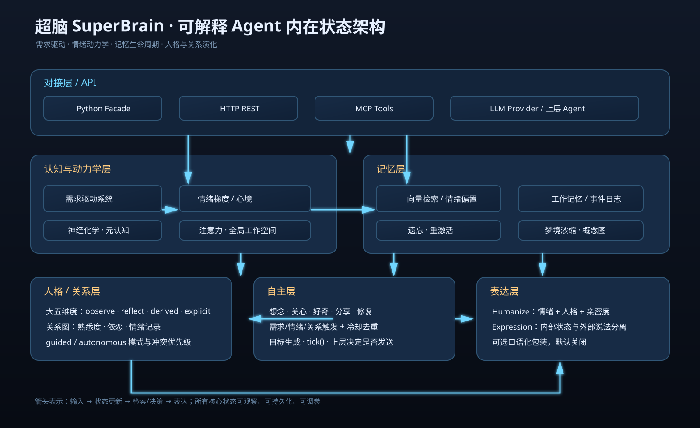
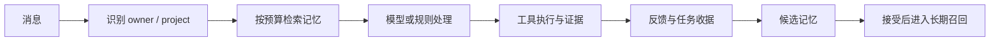

# 超脑 SuperBrain

**一个为 AI 应用提供本地记忆、状态管理和 Agent 基础能力的 Python 核心库。**  
**A Python library that adds local memory, state management, and agent building blocks to AI applications.**

> v1.21.2 · Python 3.10+ · 核心库零第三方依赖 · MIT License

## 这是什么 / What is it?

如果你正在做聊天助手、Telegram Bot、网页 AI 或自动化 Agent，通常需要自己处理：
- 用户偏好和项目资料保存在哪里；
- 如何在下一次对话找到相关信息；
- 对话太长时如何压缩；
- 如何保存角色状态和任务状态；
- 如何把记忆、规划、工具调用接到不同模型。

SuperBrain 把这些常见能力整理成一个可以嵌入应用的库。它不替代大模型，也不是一个完整的聊天产品；你的应用仍需要提供模型、界面、Bot 通道和实际工具。

If you are building a chatbot, Telegram bot, web AI product, or automation agent, SuperBrain provides reusable building blocks for local memory, state, conversation compression, planning, and tool integration. It does not replace an LLM or provide a complete chat product.

## 一个简单例子 / A simple example

```python
from superbrain import SuperBrain
from superbrain.core.llm import LLMResponse

class DemoLLM:
    def chat(self, messages, tools=None, **kwargs):
        return LLMResponse(content="这是一个离线演示回复")

brain = SuperBrain.from_llm(DemoLLM())
brain.remember("这个项目使用 Python，回答先给结论再给步骤")
print(brain.recall("项目使用什么语言"))
print(brain.state())
brain.save("brain.db")
brain.close()
```

记忆保存在本地 SQLite 文件中。重新打开同一个文件，就可以继续使用已保存的记忆和状态。

Memory is stored in a local SQLite file. Reopen the same file to continue using saved memories and state.

## 主要能力 / Main capabilities

### 记忆 / Memory
- 工作、情景、语义和程序记忆的组织方式；
- 关键词、向量和关联关系的混合检索；
- 记忆去重、衰减、巩固和概念索引；
- SQLite 持久化、保存和恢复；
- 对话历史预算、滚动摘要和工具输出清理。

默认向量使用字符特征哈希，因此安装简单、体积小、无需下载模型；它不是专门训练的语义模型，复杂语义的效果需要由你的应用评估。

The default embedder uses deterministic character hashing. It is small and dependency-free, but it is not a trained semantic embedding model.

### 角色状态 / Character and interaction state

身份、关系、需求、情绪和自我模型用于保存可观察的数值状态，并影响部分检索和表达规则。这些是软件抽象，不代表真实情绪、意识或人类大脑。人性化表达默认关闭。

### Agent 基础能力 / Agent building blocks
- 目标和规划；
- Function calling 工具注册；
- 调度和自动保存；
- 自主想法候选生成；
- 经验整理和技能蒸馏接口；
- HTTP 和 MCP 接入层。

“自主思考”和“学习”指规则驱动的状态更新、经验整理或候选内容生成，不是自动训练底层大模型。

## 三种接入方式 / Three integration options

| 方式 / Method | 适合场景 / Use case |
|---|---|
| Python 门面库 / Python facade | 已有 Python Agent 或 Bot |
| HTTP 服务 / HTTP server | 其他语言、独立进程或本地服务 |
| MCP server | 让支持 MCP 的 Agent 调用记忆和状态工具 |

开始前请阅读 [新手上手](docs/GETTING_STARTED.md)、[接入指南](INTEGRATION.md)、[开发说明](docs/DEVELOPMENT.md)、[常见问题](docs/FAQ.md) 和 [当前状态](docs/STATUS.md)。

## 安装 / Installation

```bash
python -m pip install .
```

安装交付 wheel：
```bash
python -m pip install dist/superbrain-1.21.2-py3-none-any.whl
```

启用 MCP：
```bash
python -m pip install ".[mcp]"
```

## 数据、费用和隐私 / Data, cost, and privacy
- 记忆默认保存在本地 SQLite；
- 离线记忆示例不需要 API；
- 聊天、摘要、学习或规划可能调用外部模型并产生费用；
- 配置模型后，消息和选中的上下文可能离开本机；
- 不要把 API 密钥、密码、私钥、生产数据库或私人对话提交到 Git；
- HTTP 服务默认监听本机地址，当前没有内置公网身份认证，不应直接暴露到互联网。

## 当前限制 / Current limitations
- 本项目不是 AGI，也不是人类大脑的完整模拟；
- 没有保证记忆召回、摘要压缩或模型回答永远正确；
- 默认哈希检索效果需要按你的数据集评估；
- 没有把 Telegram、SSH、生产运维或多租户权限做成开箱即用功能；
- 没有完成大规模、高并发和长时间无人值守的独立验收；
- 发布准备中的 Windows 测试仍有 SQLite 临时文件清理问题，见 [STATUS.md](docs/STATUS.md)。

## 开源许可 / License

本项目使用 [MIT License](LICENSE)。你可以使用、修改、商用和再分发，但需要保留许可证和版权声明。软件按原样提供，不承诺适合任何特定用途。

This project is released under the MIT License. You may use, modify, commercially use, and redistribute it, subject to preserving the license and copyright notice. The software is provided as-is.


## 一眼看懂 SuperBrain



SuperBrain 负责的是 Agent 的“可复用基础能力”：让不同的模型、客户端和工具共享一套记忆、状态和任务约定。它不替你选择模型，也不自动获得服务器权限。

### 它适合什么场景？

| 场景 | SuperBrain 提供的帮助 | 你仍需要准备 |
|---|---|---|
| Telegram / Web 对话机器人 | 保存用户和项目上下文，按范围召回 | Telegram Gateway 或 Web 客户端 |
| 本地开发助手 | 记录项目决策、任务状态、反馈 | LLM、Shell/Git 工具适配器 |
| 运维助手 | 保存主机别名、操作记录和任务收据 | 你自己的 SSH 执行器与凭据库 |
| 多模型应用 | 让上层通过统一调用面接入不同模型 | 对应 Provider 的授权和 API |

### 从一次对话到下一次调用



### 记忆不是一个大文本框

记忆按 `owner → project → scope` 隔离，并区分工作上下文、稳定事实、项目决策、程序性经验和可遗忘内容。每条记忆带有重要性、置信度、来源、时间和反馈；经常被成功使用的内容会获得更高召回优先级，过期或被新事实覆盖的内容会被过滤。

核心库只保存记忆元数据和内容，不保存密码、Token、私钥。认证信息应由环境变量、系统密钥环或独立 Vault 管理，记忆里只引用 profile 名称。

### 当前能力边界

- **已实现**：本地记忆存储、候选到接受流程、作用域过滤、可解释召回、反馈更新、上下文预算、checkpoint、基础 HTTP/MCP 接口。
- **可接入**：Telegram、真实 LLM、SSH、OAuth、MCP 工具和外部 Vault；仓库提供契约与适配位置，但不会凭空声称已经连接。
- **仍需完善**：Windows SQLite 连接清理、生产级 IPC 身份认证、持久任务表、真实 Gateway 和 Secret Broker。

### 项目目录

```text
src/superbrain/   核心库：memory / cognition / personality / core
examples/         离线可运行示例
docs/             快速开始、FAQ、状态和开发文档
tests/            回归测试
```

### 了解更多

- [快速开始](docs/GETTING_STARTED.md)
- [集成指南](INTEGRATION.md)
- [常见问题](docs/FAQ.md)
- [当前状态与已知限制](docs/STATUS.md)
- [安全说明](SECURITY.md)
- [MIT License](LICENSE)
